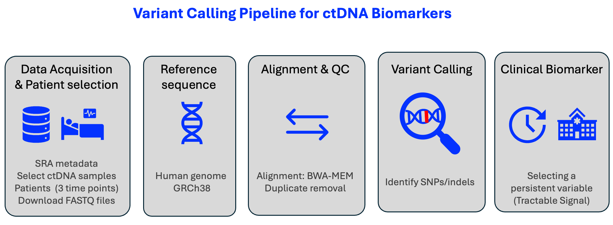
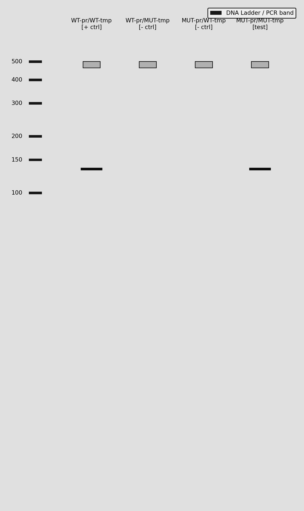

# ctDNA Biomarker Toolkit

**NGS Variant Calling & Digital PCR Assay Design for Circulating Tumor DNA Analysis**

**Author:** Luis Aguilera

[](https://opensource.org/licenses/BSD-3-Clause)


## Description:
This code is based on [Circulating tumor DNA sequencing in colorectal cancer patients treated with first-line chemotherapy with anti-EGFR.](https://www.nature.com/articles/s41598-021-95345-4). 

This code aims to identify potential variant allele frequency changes that serve as biomarkers for monitoring treatment response and tumor evolution. Then, Digital PCR Assay Development is implemented based on variant allele detection.




## Pipeline source code:

**[Source Code](vca_pipeline.ipynb)** - Jupyter notebook containing the VCA pipeline.


## Droplet Digital PCR  (ddPCR) Assay Design

**[ddPCR Design Notebook (development)](dev/dpcr_rare_mutation_detection.ipynb)** - Simulate Droplet Digital PCR assays for absolute quantification of ctDNA.

- Allele-specific probe design (FAM/VIC dual-color assays)
- Droplet partitioning simulation using Poisson statistics
- Limit of detection (LOD) calculations (down to 0.01% VAF)
- 1D Amplitude plots


## PCR Assay Design

**[PCR Diagnostics](dev/pcr_design_simulation.ipynb)** - PCR design for clinical diagnostic development.




## Project Planning Documents

**[TODO List](TODO.md)** - Comprehensive development roadmap with prioritized tasks.


## Data

**Source:** NCBI SRA BioProject [PRJNA714799](https://www.ncbi.nlm.nih.gov/bioproject/PRJNA714799)

**Samples:** Circulating tumor DNA from colorectal cancer patients collected at multiple timepoints:
- Pre-treatment (baseline)
- During treatment (first follow-up)
- Post-treatment (final timepoint)


## Installation

### Prerequisites
- [Anaconda](https://www.anaconda.com) or Miniconda
- ~50 GB disk space for reference genome and sequencing data

To install this repository and all its dependencies, we recommend using [Anaconda](https://www.anaconda.com).

* Clone the repository:
```sh
git clone https://github.com/luisub/circulating_tumor_DNA_analysis.git
```

* Create a virtual environment from the `environment.yml` file and activate it:
```sh
conda env create -f environment.yml
conda activate vca_env
```

```
ctDNA_analysis - Code Architecture/
├── 📁 src/                                                   # Core source code
│   ├── main_code.py                                          # (development)
│   └── 📁 utils/                                             # Utility functions
│       ├── imports.py                                        # Central import management (development)
├── 📁 pipelines/                                             # (development) Complete analysis workflows
│   ├── single_patient_pipeline.py                            # End-to-end single patient analysis (development)
│   └── batch_processing_pipeline.py                          # Multi-patient batch processing (planned)
├── 📁 dev/                                                   # (development) Simulation analysis
│   ├── pcr_design_simulation.ipynb                           # Simulating PCR diagnostic assay (development)
│   └── pcr_visualization.py                                  # Visualize PCR gel (development)
├── 📁 notebooks/                                             # (Future re-organization) Jupyter notebooks 
│   ├── variant_calling_analysis_cleaned.ipynb                # Main analysis notebook
├── 📁 docs/                                                  # Documentation
│   ├── user_guide.md                                         # Complete user manual (planned)
│   ├── TODO.md                                               # Development roadmap 
├── 📁 data/                                                  # Data directory (gitignored)
│   ├── 📁 raw/                                               # Raw sequencing data (SRA downloads)
│   ├── 📁 reference/                                         # Reference genomes (GRCh38)
│   ├── 📁 aligned/                                           # BAM alignment files
│   ├── 📁 variants/                                          # VCF variant call files
│   └── 📁 metadata/                                          # SRA metadata tables
├── 📁 tests/                                                 # Unit tests (planned)
│   ├── test_file.py                                          # (development) Metadata tests
├── environment.yml                                           # Conda environment file
├── LICENSE                                                   # BSD 3-Clause License
├── .gitignore                                                # Git ignore patterns
└── README.md                                                 # Project documentation
```

## License

This project is licensed under the BSD 3-Clause License - see the LICENSE file for details.