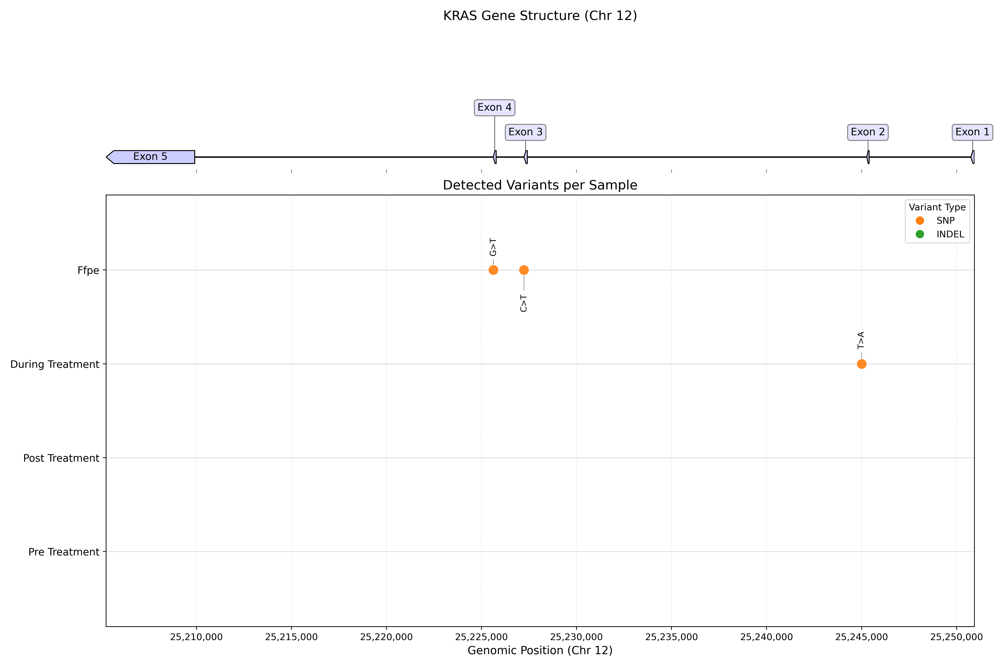

# NGS biomarker discovery toolkit

**NGS Variant Calling & Digital PCR Assay Design for Circulating Tumor DNA Analysis**

**Author:** Luis Aguilera

[](https://opensource.org/licenses/BSD-3-Clause)


## Description:
This code is based on [Circulating tumor DNA sequencing in colorectal cancer patients treated with first-line chemotherapy with anti-EGFR.](https://www.nature.com/articles/s41598-021-95345-4). 

This code aims to identify potential variant allele frequency changes that serve as biomarkers for monitoring treatment response and tumor evolution. Then, Digital PCR Assay Development is implemented based on variant allele detection.


## Data

**Source:** NCBI SRA BioProject [PRJNA714799](https://www.ncbi.nlm.nih.gov/bioproject/PRJNA714799)

**Samples:** Circulating tumor DNA from colorectal cancer patients collected at multiple timepoints:
- Pre-treatment (baseline)
- During treatment (first follow-up)
- Post-treatment (final timepoint)


## Installation

### Prerequisites
- [Anaconda](https://www.anaconda.com) or Miniconda
- ~50 GB disk space for reference genome and sequencing data

To install this repository and all its dependencies, we recommend using [Anaconda](https://www.anaconda.com).

* Clone the repository:
```sh
git clone https://github.com/luisub/NGS_biomarker_discovery_toolkit.git
```

* Create a virtual environment from the `environment.yml` file and activate it:
```sh
conda env create -f environment.yml
conda activate vca_env
```


## Workflow & Code Architecture

The analysis follows a 3-step process. Each step corresponds to a specific notebook and directory in the repository.

### 1. Variant Calling Analysis
**Goal**: Identify somatic variants (SNPs/Indels) from NGS data.
- **Notebook**: [vca_pipeline_improved.ipynb](pipelines_vca/vca_pipeline_improved.ipynb)
- **Directory**: `pipelines_vca/`
- **Output**: Annotated VCF files (`pipelines_vca/data/variants/*.lofreq.ann.vcf.gz`).



### 2. Primer Design
**Goal**: Design dual-color ddPCR assays for detected variants.
- **Notebook**: [ddpcr_primer_design.ipynb](digital_PCR/ddpcr_primer_design.ipynb)
- **Directory**: `digital_PCR/`
- **Output**: Primer/Probe sequences (`ddpcr_snp_assays.csv`) and virtual gel images.


### 3. Digital PCR Simulation
**Goal**: Simulate ddPCR droplet partitioning and rare mutation detection.
- **Notebook**: [ddpcr_simulation.ipynb](digital_PCR/ddpcr_simulation.ipynb)
- **Directory**: `digital_PCR/`
- **Output**: Simulated 1D/2D plots and Limit of Detection (LOD) analysis.


## Code Architecture

```
ctDNA_analysis - Code Architecture/
├── 📁 pipelines_vca/                                         # Variant Calling Analysis Pipeline
│   ├── vca_pipeline_improved.ipynb                           # Main pipeline notebook
│   ├── vca_pipeline.ipynb                                    # (Legacy) Original pipeline notebook
│   ├── run_vca_pipeline.py                                   # Main pipeline script (FastQC, fastp, Lofreq, SnpEff)
│   ├── run_pipeline.sh                                       # Pipeline launcher script
│   ├── plots_sequences.py                                    # Protein mutation visualization
│   └── 📁 data/                                              # Data directory (input/output)
├── 📁 digital_PCR/                                           # Digital PCR & Primer Design
│   ├── ddpcr_primer_design.ipynb                             # ddPCR SNP assay design notebook
│   ├── ddpcr_simulation.ipynb                                # ddPCR simulation notebook
│   ├── pcr_visualization.py                                  # Visualization utilities
│   ├── dpcr_nanoplate_visualization.py                       # Nanoplate visualization
│   └── ddpcr_snp_assays.csv                                  # Output: Designed assays
├── 📁 machine_learning/                                      # Machine Learning (Planned)
│   └── TODO_ML.md                                            # ML roadmap
├── 📁 config/                                                # Configuration files
│   └── pipeline_config.yml                                   # Pipeline configuration
├── 📁 docs/                                                  # Documentation
│   └── pipeline_guide.md                                     # Complete user manual
├── TODO.md                                                   # Development roadmap
├── environment.yml                                           # Conda environment file
├── LICENSE                                                   # BSD 3-Clause License
├── .gitignore                                                # Git ignore patterns
└── README.md                                                 # Project documentation
```

## Project Planning Documents

**[TODO List](TODO.md)** - Comprehensive development roadmap with prioritized tasks.


## License

This project is licensed under the BSD 3-Clause License - see the LICENSE file for details.